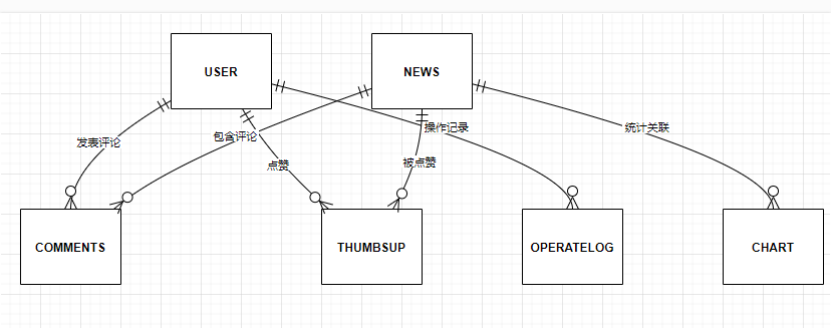

# news-project
### 1 新闻管理与浏览系统

本项目是一个基于 Vue 3 和 Spring Boot 3 的新闻管理与浏览系统，分为管理端和用户端两部分，支持新闻的爬取、展示、评论、点赞等功能。 

### 2 模块设计规划

- 用户管理模块：包括用户注册、登录、个人资料管理、多语言偏好设置等功能；
- 新闻管理模块：负责新闻源管理、新闻文章抓取与存储、新闻翻译和显示；
- 评论和点赞模块：处理用户评论、点赞功能及其显示，包括用户反馈和举报管理；
- 多语言支持模块：集成翻译API，处理前端和后端的多语言需求；

- 通知模块：管理用户订阅、推送通知和广告管理；
- 数据分析模块：收集用户的阅读、互动数据，并提供数据可视化报表；
- 缓存模块：实现热门新闻和用户最近访问文章的缓存。

### 3 项目结构

```shell
news project/
├── admin/       # 管理端前端代码
├── manager/     # 后端代码
├── news/        # 用户端前端代码
├── tables/      # 数据库表结构和示例数据
```

#### 3.1 管理前端（AI根据项目生成）

采用 Vue 3、Element Plus 和 Pinia 构建，功能包括用户管理、新闻管理、评论与点赞、操作日志和统计信息展示。项目结构清晰，模块化程度高，适合扩展和维护。

- 技术栈：Vue 3 + Element Plus + Pinia + Vite
- 功能:
  - 新闻管理：支持新闻的增删改查。
  - 用户管理：管理用户信息及权限。
  - 操作日志：记录管理员的操作行为。
  - 数据统计：展示新闻的浏览量、点赞量、评论量等统计信息。

该项目是一个基于 Vue 3 和 Vite 的新闻管理系统前端项目，文件结构如下：

##### 3.1.1 根目录文件结构

- .gitignore: Git 忽略文件，指定不需要被版本控制的文件和目录。
- index.html: 项目入口 HTML 文件，挂载 Vue 应用到 #app。
- jsconfig.json: 配置文件，用于定义路径别名（@ 指向 src 目录）。
- package.json: 项目配置文件，定义了依赖、脚本和项目信息。
- README.md: 项目说明文档，包含安装和运行说明。
- vite.config.js: Vite 配置文件，定义了插件、路径别名和开发服务器代理等。
- .vscode/: VS Code 配置文件夹，推荐了 Vue.volar 插件。
  - extensions.json: 推荐的 VS Code 插件配置。
- **public**: 静态资源文件夹，存放不会被打包的资源。
  - favicon.ico: 网站图标。

##### 3.1.2 src 目录文件结构

项目的主要源代码目录，包含以下子目录和文件：

**核心文件**

- App.vue: Vue 应用的根组件。
- main.js: 应用入口文件，初始化 Vue 应用并挂载到 DOM。

**子目录**

1. api/: API 请求模块。
   - admin.js: 定义了与后端交互的 API 方法（如用户登录、新闻列表、点赞等）。

2. assets/: 静态资源文件夹。
   - 包含图片（如 logo.svg、avatar.jpg）和样式文件（如 main.css、main.scss）。

3. components/: 组件文件夹。
   - icons/: 存放图标组件（具体内容未列出）。

4. router/: 路由配置。
   - index.js: 定义了路由规则和路由守卫。

5. stores/: 状态管理（Pinia）。
   - token.js: 管理用户的登录令牌。
   - userInfo.js: 管理用户信息。

6. utils: 工具模块。
   - request.js: Axios 请求封装，包含请求和响应拦截器。

7. views/: 页面组件。
   - comments.vue: 用户评论管理页面。
   - count.vue: 统计信息页面，展示新闻、浏览量等数据。
   - Layout.vue: 主布局组件，包含侧边栏和头部导航。
   - login.vue: 登录页面。
   - news.vue: 新闻管理页面。
   - operate.vue: 操作日志页面。
   - thumbsUp.vue: 点赞信息页面。
   - userInfo.vue: 用户信息管理页面。

##### 3.1.3 功能模块

1. 用户管理：
   - 登录页面（login.vue）通过 userLoginService 调用后端登录接口。
   - 用户信息管理页面（userInfo.vue）支持分页、删除用户和修改权限。

2. 新闻管理：
   - 新闻列表页面（news.vue）支持搜索、分页和删除新闻。
   - 新闻统计页面（count.vue）展示新闻的浏览量、点赞量等数据，并通过 ECharts 绘制图表。

3. 评论与点赞：
   - 评论管理页面（comments.vue）展示用户评论信息。
   - 点赞管理页面（thumbsUp.vue）展示点赞记录。

4. 操作日志：
   - 操作日志页面（operate.vue）展示用户操作记录。

5. 布局与导航：
   - 主布局组件（Layout.vue）包含侧边栏导航和头部用户信息。

6. 状态管理：
   - 使用 Pinia 管理用户信息和令牌，支持持久化存储。

7. 请求封装：
   - 使用 Axios 封装请求，统一处理请求头和错误响应。

#### 3.2 用户前端（AI根据项目生成）

采用 Vue 3、Element Plus 和 Pinia 构建，功能包括用户管理、新闻管理、评论与点赞、国际化支持等。项目结构清晰，模块化程度高，适合扩展和维护。

- 技术栈:：Vue 3 + Element Plus + Pinia + Vite
- 功能：
  - 新闻浏览：展示热门新闻和最新新闻。
  - 新闻详情：支持查看新闻详情、发表评论、点赞新闻。
  - 用户中心：支持用户信息的查看与修改。
  - 多语言支持：支持中文、英文、日语、韩语、意大利语等多语言切换。

该项目是一个基于 Vue 3 和 Vite 的新闻管理系统前端项目，文件结构如下：

##### 3.2.1 根目录文件结构

- .gitignore: 配置需要忽略的文件和目录（如 node_modules、日志文件等）。
- index.html: 项目入口 HTML 文件，挂载 Vue 应用到 #app。
- jsconfig.json: 配置文件，用于定义路径别名（@ 指向 src 目录）。
- package.json: 项目配置文件，定义依赖、脚本和项目信息。
- README.md: 项目说明文档，包含安装和运行说明。
- vite.config.js: Vite 配置文件，定义插件、路径别名和开发服务器代理等。
- .vscode/extensions.json: 推荐的 VS Code 插件配置（推荐安装 Vue.volar 插件）。
- **public**: 静态资源文件夹，存放不会被打包的资源。
  - favicon.ico: 网站图标。

##### 3.2.2 src 目录文件结构

项目的主要源代码目录，包含以下子目录和文件：

**核心文件**

- App.vue: Vue 应用的根组件。
- main.js: 应用入口文件，初始化 Vue 应用并挂载到 DOM。

**子目录**

1. api/: API 请求模块，封装与后端交互的接口。
   - comments.js: 评论相关接口（如点赞、添加评论、获取评论）。
   - login.js: 登录和注册接口。
   - news.js: 新闻相关接口（如获取热门新闻、新闻详情）。
   - user.js: 用户相关接口（如更新用户信息、上传头像）。

2. assets/: 静态资源文件夹。
   - base.css: 基础样式文件。
   - main.css: 全局样式文件。

3. components/: 组件文件夹。
   - icons/: 存放图标组件（具体内容未列出）。

4. lang/: 国际化语言包。
   - zh.js: 中文语言包。
   - en.js: 英文语言包。
   - ry.js: 日语语言包。
   - hy.js: 韩语语言包。
   - ydl.js: 意大利语语言包。

5. router/: 路由配置。
   - index.js: 定义路由规则和路由守卫。

6. stores/: 状态管理（Pinia）。
   - token.js: 管理用户登录令牌。
   - userInfo.js: 管理用户信息。

7. utils/: 工具模块。
   - request.js: Axios 请求封装，包含请求和响应拦截器。

8. view/: 页面组件。
   - HomeView.vue: 首页，展示热门新闻和最新新闻。
   - Login.vue: 登录和注册页面。
   - NewsDetail.vue: 新闻详情页面，支持点赞和评论。
   - Person.vue: 个人中心页面，支持修改个人信息和上传头像。

##### 3.2.3 功能模块

1. 用户管理：
   - 登录和注册页面（Login.vue）通过 userLoginService 和 userRegisterService 调用后端接口。
   - 个人中心页面（Person.vue）支持修改个人信息和上传头像。

2. 新闻管理：
   - 首页（HomeView.vue）展示热门新闻和最新新闻，支持分页。
   - 新闻详情页面（NewsDetail.vue）展示新闻内容，支持点赞和评论。

3. 评论与点赞：
   - 评论功能通过 addCommentsService 和 getCommentsService 实现。
   - 点赞功能通过 thumbsUpService 实现。

4. 国际化支持：
   - 使用 vue-i18n 实现多语言支持，语言包存放在 lang/ 目录下。

5. 状态管理：
   - 使用 Pinia 管理用户信息和令牌，支持持久化存储。

6. 请求封装：
   - 使用 Axios 封装请求，统一处理请求头和错误响应。

#### 3.3 后端 （AI根据项目生成）

Spring Boot 应用，采用分层架构（Controller-Service-Mapper），并结合 MyBatis 进行数据库操作。项目功能包括用户管理、新闻管理、评论与点赞、操作日志记录等，支持日志记录、定时任务和文件上传等功能。

- 技术栈: Spring Boot + MyBatis + MySQL
- 功能：
  - 新闻爬取：定时爬取新闻数据并存储到数据库。
  - 用户管理：支持用户注册、登录、权限管理。
  - 日志记录：通过 AOP 实现操作日志记录。
  - 数据统计：提供新闻浏览量、点赞量、评论量等统计数据的接口。

##### 3.3.1 根目录文件结构

- .gitattributes: Git 属性配置文件，用于设置文件的换行符规则。
- .gitignore: Git 忽略文件，指定不需要被版本控制的文件和目录。
- HELP.md: 帮助文档（可能是项目说明或使用指南）。
- mvnw 和 mvnw.cmd: Maven Wrapper 脚本，用于在没有全局安装 Maven 的情况下运行 Maven。
- pom.xml: Maven 项目的核心配置文件，定义了依赖、插件和项目的基本信息。
- .idea/: IntelliJ IDEA 的项目配置文件夹。
- .mvn/: Maven Wrapper 的配置文件夹。
- logs: 日志文件夹，存储运行时生成的日志文件。
- src: 项目源代码目录，包含主代码和测试代码。
- target: Maven 构建输出目录，包含编译后的文件和生成的 JAR 包。

##### 3.3.2 src 目录文件结构

- main/: 主代码目录。
  - java/: Java 源代码。
    - com.example.manager 主包，包含以下子模块：
      - controller/: 控制器层，处理 HTTP 请求。
      - service/ 和 serviceImpl/: 服务层接口及其实现，包含业务逻辑。
      - mapper/: 数据访问层，使用 MyBatis 进行数据库操作。
      - entity/: 实体类，定义数据库表对应的 Java 对象。
      - utils/ 工具类，提供通用功能（如 JWT 和 ThreadLocal 工具）。
      - config/: 配置类，定义 Spring Boot 的自定义配置（如拦截器、静态资源映射）。
      - aspect/: 切面类，用于日志记录和 AOP 功能。
      - interceptors/: 拦截器类，用于处理请求的预处理逻辑。
    - ManagerApplication.java**: 主启动类，标注了 @SpringBootApplication，用于启动 Spring Boot 应用。
  - resources/: 资源文件目录。
    - application.properties: Spring Boot 配置文件。
    - log4j2-spring.xml: Log4j2 的日志配置文件。
    - static/: 静态资源目录（如图片、CSS、JS 文件）。
- test/: 测试代码目录。
  - java/: 测试代码。
    - com.example.manager.ManagerApplicationTests.java: 测试类，用于测试 Spring Boot 应用的上下文加载。

##### 3.3.3 关键功能模块

1. 用户管理：
   - 控制器：UserController.java
   - 服务层：UserService 和 UserServiceImpl
   - 数据访问层：UserMapper
   - 实体类：User 和 UserInfo

2. 新闻管理：
   - 控制器：NewsController 和 NewsCrawlerController
   - 服务层：NewsService 和 NewsServiceImpl
   - 数据访问层：NewsMapper
   - 实体类：News

3. 评论与点赞：
   - 控制器：CommentsController
   - 服务层：CommentsService 和 CommentsServiceImpl
   - 数据访问层：CommentsMapper
   - 实体类：Comments 和 ThumbsUp

4. 操作日志：
   - 控制器：OperateLogController
   - 服务层：OperateLogService 和 OperateLogServiceImpl
   - 数据访问层：OperateLogMapper
   - 实体类：OperateLog

5. 日志与拦截：
   - 日志配置：log4j2-spring.xml
   - AOP 日志：LoggerAspect 和 SystemLogger
   - 拦截器：LoginInterceptor
   - IP 日志记录：IpLoggerFilter

6. 工具类：
   - JWT 工具：JwtUtil
   - ThreadLocal 工具：ThreadLocalUtil
   - MD5 加密工具：MD5Config

#### 3.4 数据库

- 包含数据库表结构和示例数据文件。

##### 3.4.1表结构概览

|    表名    |     描述     | 主键 |  引擎  | 字符集             |
| :--------: | :----------: | :--: | :----: | ------------------ |
|   chart    | 统计图表数据 |  id  | InnoDB | utf8mb4_0900_ai_ci |
|  comments  | 用户评论记录 |  id  | InnoDB | utf8mb4_0900_ai_ci |
|    news    |   新闻数据   |  id  | InnoDB | utf8mb4_0900_ai_ci |
| operatelog | 用户操作日志 |  id  | InnoDB | utf8mb4_0900_ai_ci |
|  thumbsup  | 用户点赞记录 |  id  | InnoDB | utf8mb4_0900_ai_ci |
|    user    |   用户信息   |  id  | InnoDB | utf8mb4_0900_ai_ci |

##### 3.4.2 chart（统计图表）

|  字段名  | 类型 | 允许空 | 默认值 |      描述      |
| :------: | :--: | :----: | :----: | :------------: |
|    id    | int  |   NO   |   -    |      主键      |
|   data   | date |  YES   |  NULL  |    统计日期    |
|  views   | int  |  YES   |  NULL  |  当日总浏览量  |
| thumbsUp | int  |  YES   |  NULL  |  当日总点赞数  |
|   news   | int  |  YES   |  NULL  | 当日新增新闻数 |
| comments | int  |  YES   |  NULL  | 当日新增评论数 |

索引：

主键：id

##### 3.4.3 comments（评论表）

|   字段名   |     类型     | 允许空 | 默认值 |     描述      |
| :--------: | :----------: | :----: | :----: | :-----------: |
|     id     |     int      |   NO   |   -    | 主键（自增）  |
|   newId    |     int      |   NO   |   -    | 关联的新闻ID  |
|  comments  | varchar(255) |  YES   |  NULL  |   评论内容    |
|   userId   |     int      |  YES   |  NULL  |    用户ID     |
| createUser | varchar(255) |  YES   |  NULL  |  评论人名称   |
| createTime |   datetime   |  YES   | NOW()  |   评论时间    |
|   avatar   | varchar(255) |  YES   |  NULL  | 评论人头像URL |

索引：

主键：id

##### 3.4.4 news（新闻表）

|   字段名   |     类型     | 允许空 | 默认值 |     描述      |
| :--------: | :----------: | :----: | :----: | :-----------: |
|     id     |     int      |   NO   |   -    | 主键（自增）  |
|   newId    | varchar(200) |  YES   |  NULL  | 新闻唯一标识  |
|   title    | varchar(255) |  YES   |  NULL  |   新闻标题    |
| detailUrl  | varchar(255) |  YES   |  NULL  | 新闻详情页URL |
| createTime | varchar(200) |  YES   |  NULL  | 新闻发布时间  |
|    text    |     text     |  YES   |  NULL  |   新闻正文    |
|  thumbsUp  |     int      |  YES   |   0    |    点赞数     |
|  comments  |     int      |  YES   |   0    |    评论数     |
|   image    |     text     |  YES   |  NULL  |  新闻图片URL  |
|   views    |     int      |  YES   |   0    |    浏览量     |

索引：

主键：id

##### 3.4.5 operatelog（操作日志表）

|      字段名      |     类型     | 允许空 | 默认值 |     描述     |
| :--------------: | :----------: | :----: | :----: | :----------: |
|        id        |     int      |   NO   |   -    | 主键（自增） |
|    operateBy     | varchar(50)  |  YES   |  NULL  |  操作用户名  |
|  operateContent  | varchar(255) |  YES   |  NULL  |   操作内容   |
|   operateTime    |   datetime   |  YES   |  NULL  |   操作时间   |
| operateException | varchar(255) |  YES   |  NULL  | 操作异常信息 |

索引：

主键：id

##### 3.4.6 thumbsup（点赞表）

|   字段名   |     类型     | 允许空 |      默认值       |     描述     |
| :--------: | :----------: | :----: | :---------------: | :----------: |
|     id     |     int      |   NO   |         -         | 主键（自增） |
|   newId    |     int      |  YES   |       NULL        | 关联的新闻ID |
|   userId   |     int      |  YES   |       NULL        |    用户ID    |
| thumbsUser | varchar(255) |  YES   |       NULL        |  点赞人名称  |
| createTime |   datetime   |  YES   | CURRENT_TIMESTAMP |   点赞时间   |

索引：

主键：id

##### 3.4.7 user（用户表）

|  字段名  |     类型     | 允许空 | 默认值 |           描述           |
| :------: | :----------: | :----: | :----: | :----------------------: |
|    id    |     int      |   NO   |   -    |       主键（自增）       |
| username | varchar(200) |  YES   |  NULL  |          用户名          |
| password | varchar(200) |  YES   |  NULL  |     密码（MD5加密）      |
|   name   | varchar(200) |  YES   |  NULL  |           昵称           |
|  email   | varchar(200) |  YES   |  NULL  |           邮箱           |
|  phone   | varchar(200) |  YES   |  NULL  |          手机号          |
| address  | varchar(200) |  YES   |  NULL  |           地址           |
|   role   |     int      |   NO   |   0    | 角色（0:用户，1:管理员） |
|  status  |     int      |   NO   |   1    |  状态（0:禁用，1:启用）  |
|  avatar  | varchar(255) |  YES   |  NULL  |         头像URL          |

索引：

主键：id

普通索引：user_username_index（字段username）

##### 3.4.8 表关系说明



##### 3.4.9 外键关联

|   表名   |  字段  | 关联表 | 关联字段 |
| :------: | :----: | :----: | :------: |
| comments | newId  |  news  |    id    |
| comments | userId |  user  |    id    |
| thumbsup | newId  |  news  |    id    |
| thumbsup | userId |  user  |    id    |

##### 3.4.10 数据字典

| 表名 | 字段名 | 数据类型 | 是否为空 |          描述          |
| :--: | :----: | :------: | :------: | :--------------------: |
| user |  role  |   int    |    NO    | 角色：0-用户，1-管理员 |
| user | status |   int    |    NO    |  状态：0-禁用，1-启用  |

### 4 开发环境

#### 4.1 前端

IDE：Visual Studio Code（最新版）

vscode相关插件：Vue - Official

环境：vue.js开发工具

#### 4.2 后端

IDE：IntelliJ IDEA Ultimate（最新版、专业版）

数据库：MySQL（最新版）

环境：jdk17（spring book 3 要求jdk版本最低为17）、maven3.9.9（最新版）、tomcat11（最新版）、node.js和npm（最新版）

#### 4.3 环境测试

jdk 测试：

```shell
#查看 jdk 版本号，出现版本号即成功
Java -version
```

Maven 测试：

```shell
#查看 Maven 版本号，出现版本号即成功
mvn -version
```

Tomcat 测试：

```shell
#点击 startup.bat 启动后，打开浏览器
http://localhost:8080/
```

nodejs 测试：

```shell
#查看 nodejs 版本号，出现版本号即成功
node -v
npm -v
```

vue 3 测试：

```shell
#查看全局安装的所有 npm 包，包括 Vue CLI（如果已安装）
npm list -g --depth=0

#显示如下
C:\Users\LAZNT>npm list -g --depth=0
E:\java\node\node_global
+-- @vue/cli@5.0.8
+-- vue@3.5.12
+-- webpack-cli@5.1.4
+-- webpack@5.95.0
`-- yarn@1.22.22
```

### 5 快速开始

#### 5.1 克隆项目

```shell
cd news-project
git clone https://github.com/your-repo/news-project.git
```

#### 5.2 启动后端

1. 启动 IntelliJ IDEA Ultimate；
2. 选择 "Open" 或 "Import Project"；
3. 浏览到后端项目文件夹"manager"并选择；
4. 修改用户头像路径，WebConfig.java（com.example.manager.config）
5. 在项目的src/main/resources/application.properties中配置MySQL连接参数，如账号和密码；
6. 在MySQL中创建数据库，导入数据库sql文件；
7. 使用IDEA中的Maven插件来下载项目的依赖项；
8. 在项目中的src/main/java/com.manager找到启动类ManagerApplication.java，点击运行后端项目。

#### 5.3 启动前端

1. 启动VS Code；
2. 选择 "File" 或 "Import Project"；
3. 浏览到前端项目文件夹"news"和管理端文件夹"admin"并选择；
4. 按 ctrl+alt+` 打开命令行工具；
5. 在命令行工具中，运行 "npm install " 安装所有依赖。
6. 运行"npm run dev"启动前端项目。

#### 5.5 访问项目

- 管理端：http://localhost:5173/

- 用户端：http://localhost:5174/

  用户名：admin

  密码：123456

### 6 贡献指南

欢迎对本项目提出建议或贡献代码。

### 7 赞助

如果你碰巧喜欢这个项目，并希望我继续维护下去，请考虑赞助我或提供一个单一的捐款！


### 8 视频演示/项目部署帮助

如需演示视频或项目部署帮助，请赞助并给我发送邮件。email：ynccgg@qq.com

### 9 许可证